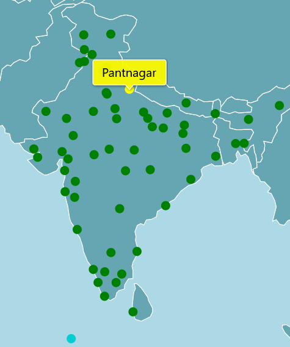

# Welcome to HAWA-ON    

Table of contents    
- What is HAWA-ON?
- Our Services
- Best practices

## What is HAWA-ON?
HAWA-ON is a weather platform which provides latest weather data for all the major airports across India. Our services can be used by meterologists, scientists, pilots and many others. We render this weather data in the form of tables and maps which would allow anyone using the site to gain an instant knowledge of weather across the airports of India.    

## Our Services
1. Table-view    
The **Table-view** page provides a tabular representation of latest weather data. Each entry in the table follows a `color key`.

As shown, the `color key` consists of 4 entries. The red entry corresponds to weather unsafe for flying (The airport is represented in red colour if any of the given criteria exists - Visibility <= 1000 meter, CB reported in the cloud group,Thunderstorm/ Thundershowers reported in the weather), the yellow entry indicates marginal weather condition (The airport is represented in yellow colour if any of the given criteria exists - Visibility between >= 1000 meter and <= 1500meter), the green entry corresponds to weather condition good for flying and the blue entry corresponds to non availability of latest information.  

2. Map-view    
The **Map-view** page converts the tabular entries in the **Table-view** to markers inside a map. The markers follow the same `color key` as stated above. The map is scrollable with dynamic mouse interaction. Hovering on any part on the map will show up the name of that place. In addition, clicking or hovering on any marker on the map will display the name of the place the marker is pointing to.

3. Satellite Images
The **Satellite** page shows the latest Satellite images of India - Infrared and Water vapour. Please note that these images are a copyright of the Ministry of Earth Sciences and are for quick reference only.

4. Radars
We also provide a dedicated page for **Radars** of India. This page contains a number of buttons. Clicking on any of these buttons will show up the radar of the city shown by the respective button.

## Best practices    
1. We recommend you to refresh the page after every `10 minutes` to get the latest weather data.
2. Please follow the `color key` carefully  for better appreciation of the latest METAR data.
3. We would appreciate if you spare a few minutes and share your feedback about **HAWA-ON** at `teamhawaon@gmail.com` to address any bugs or potential issues.
4. In case the information provided in the `table-view` page does not satisfy your needs, the METAR data in detail for all the airports of Indian region can be viewed by scrolling down to the bottom of the page to the `detailed-view` button. 
5. To refresh the site instantly `refresh button` is provided at the top of each page.
